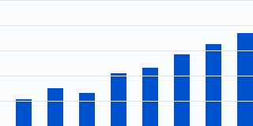
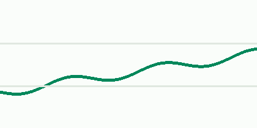
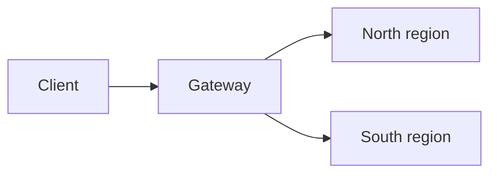
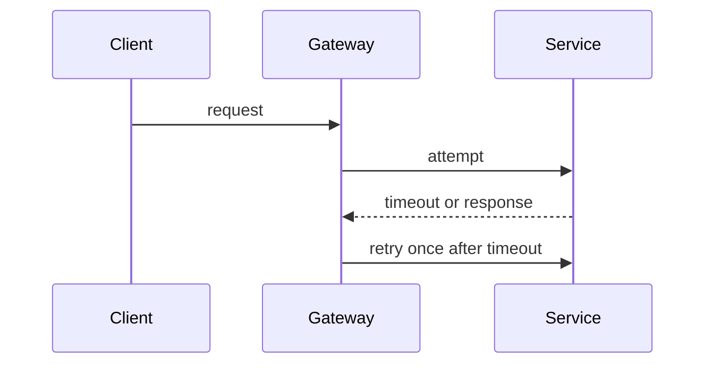

# Multi-region API architecture

The gateway routes requests to the nearest healthy service region. Both regions use the same retry limit.

## Availability comparison

| Region | Monthly availability target | p95 latency target |
|---|---:|---:|
| North | 99.97% | 180 ms |
| South | 99.95% | 210 ms |

Use the [release checklist](release-checklist.md) before deployment. The fixture's repository root is
described in [README](../README.md).

## Request routing

## Retry behavior

