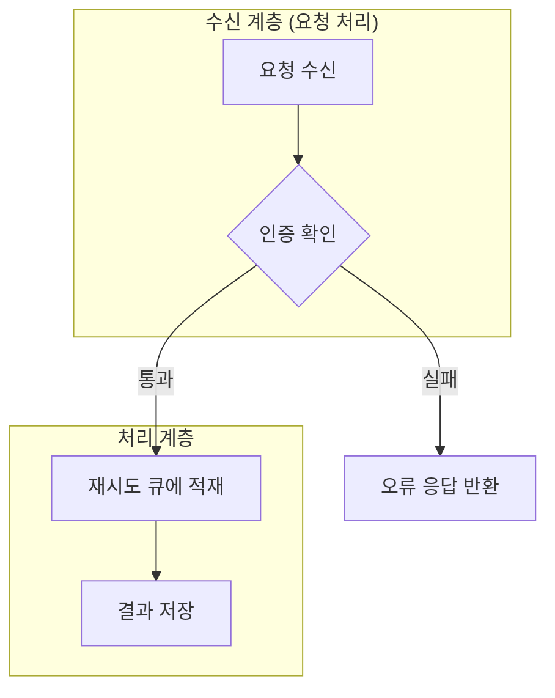

# 알림 처리 흐름

알림 서비스는 요청을 받아 인증하고 재시도 큐에 넣는다.

## 처리 단계

```mermaid
flowchart TD
    subgraph 수신 계층["수신 계층 (요청 처리)"]
      A[요청 수신] --> B{인증 확인}
    end
    subgraph 처리 계층["처리 계층"]
      C[재시도 큐에 적재] --> D[결과 저장]
    end
    B -->|통과| C
    B -->|실패| E[오류 응답 반환]
```

## 상태 요약

```mermaid
flowchart LR
    A[Start --> ]] B ---- ???
    subgraph
```
