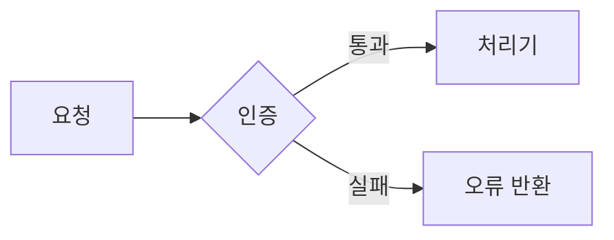

# 개발 설계 문서 작성

> 이 문서는 한국어 사용자가 내용을 확인하기 위한 참고 번역입니다. 에이전트가 스킬을
> 실행할 때 읽거나 사용하는 지침이 아닙니다. 유일한 실행 지침은 `SKILL.md`입니다.
> 두 문서가 다르면 `SKILL.md`를 기준으로 합니다.

개발 설계 문서를 새로 쓰거나 기존 문서를 개선할 때 이 규칙을 적용합니다. 규칙은 문서의
용어, 구성, 문단, 참조 방식을 다룹니다. 목차는 한 번에 정하지 않고 단계적으로 좁혀 갑니다.

## 사용 범위

- 개발 설계 문서를 새로 작성할 때
- 기존 설계 문서를 규칙에 맞게 개선하거나 지나친 상세를 줄일 때
- 설계 문서가 규칙을 지키는지 검토할 때

단순 번역, 맞춤법이나 오탈자 교정, 설계와 관계없는 문체 윤문에는 사용하지 않습니다.

## 작업 순서

1. **목적과 독자를 정합니다.** 새 문서라면 다룰 범위와 문서가 답해야 할 판단 또는 구현
   질문을 적습니다. 기존 문서라면 부족한 내용과 규칙에 어긋난 부분을 찾습니다.
2. **목차를 좁혀 확정합니다.** 아래의 "목차를 정하는 절차" 다섯 단계를 따릅니다.
   하위 소제목까지 정한 뒤에만 본문을 씁니다.
3. **규칙을 적용해 본문을 씁니다.** 용어, 구성, 문단, 표, 중복, 참조 규칙을 적용합니다.
4. **완료 점검표로 검토합니다.** 어긋난 곳을 고치고 근거를 제시할 수 없는 문장은 지웁니다.

이 규칙은 설계 문서 작업에만 적용합니다. 상위 지시와 충돌하지 않는 한 저장소의 다른
문서 작성 규칙보다 우선합니다. 사용자가 특정 규칙을 제외하라고 명시한 경우에만 뺍니다.

## 용어

| 규칙 | 내용 |
|---|---|
| 한 뜻 한 낱말 | 같은 뜻에는 항상 같은 낱말을 씁니다. 원문이나 초안의 동의어도 대표 낱말 하나로 통일합니다. |
| 쉬운 한국어 | 쉬운 한국어로 씁니다. 영어는 아래 세 경우에만 씁니다. |
| 겹치는 말 교체 | 기존 시스템 용어와 겹쳐 오해를 부르는 낱말은 다른 말로 바꿉니다. |

영어를 허용하는 세 경우는 다음과 같습니다.

- 고유명사
- 표 이름, 변수 이름처럼 코드에 실제로 있는 이름
- 알맞은 한국어가 없는 전문어

예를 들어 Git의 branch와 혼동될 수 있는 "브랜치"는 다른 말로 바꿉니다. 한 저장소에서는
DAG의 병렬 실행 구조를 "분기"로 통일했습니다.

## 구성

- 문서마다, 또 한 문서 안의 절마다 맡은 범위를 겹치지 않게 정합니다. 한 주제는 한
  곳에서만 다룹니다.
- 구현, 검증, 결정에 필요한 내용만 담습니다. 배경 설명이나 있으면 좋은 참고 정보는 뺍니다.
- 없애도 이해나 판단이 나빠지지 않는 문장은 지웁니다.
- 구획 제목은 소제목으로 만듭니다. 콜론으로 끝나는 문장을 제목으로 쓰지 않습니다.

## 크기와 한도

| 대상 | 한도 |
|---|---|
| 한 줄 | 200자 |
| 한 파일 | 500줄 |
| 절 깊이 | 3단계 |

한도를 넘지 않으면 파일을 나누지 않습니다. 넘으면 역할에 따라 나눕니다.

## 문단, 표, 다이어그램

- 한 문단에는 하나의 핵심만 담습니다.
- 여러 항목을 같은 기준으로 비교하거나 나열할 때는 산문이나 글머리표가 아니라 표를 씁니다.
- 구조, 흐름, 상태 변화, 구성 요소의 관계처럼 그림이 글보다 잘 전달하는 부분은 Mermaid
  다이어그램으로 나타냅니다.
- 단순한 사실 나열이나 한 줄 설명에는 다이어그램을 넣지 않습니다. 같은 내용을 글과
  그림에 반복하지 않습니다.
- 줄은 문장이 끝난 뒤에만 나눕니다. 문장 중간에서는 나누지 않습니다.
- 새 문단은 빈 줄 하나로 구분합니다.
- 제목, 표, 코드 블록, 목록의 앞뒤에는 빈 줄을 둡니다.
- 목록 항목이 여러 줄이면 이어지는 줄을 항목 글자가 시작하는 위치에 맞춰 들여씁니다.
- 문단 안에서 줄을 나누기 전에 새 문단, 목록, 표로 구조를 바꾸는 편이 나은지 확인합니다.
- 문단 안 줄바꿈이 꼭 필요하면 눈에 보이지 않는 공백 두 칸 대신 `<br>`을 씁니다.
  표의 칸 안에서도 `<br>`을 씁니다.

표로 바꾸는 예는 다음과 같습니다.

```markdown
# 나쁜 예: 같은 기준의 나열을 산문으로 작성
개발 환경은 로그를 남기고 캐시를 끄며, 운영 환경은 로그를 줄이고 캐시를 켠다.

# 좋은 예: 표
| 환경 | 로그 | 캐시 |
|---|---|---|
| 개발 | 남김 | 끔 |
| 운영 | 줄임 | 켬 |
```

다이어그램으로 나타내면 좋은 예는 다음과 같습니다.

~~~markdown
# 나쁜 예: 단계 사이의 흐름을 산문으로 설명
요청이 들어오면 인증을 거치고, 통과하면 처리기로 보내고, 실패하면 오류를 돌려준다.

# 좋은 예: Mermaid 흐름도

~~~

## 중복과 참조

- 주석과 문서 문자열을 포함한 코드에서는 문서를 참조하지 않습니다. 문서는 코드 수정 없이
  개편하거나 삭제할 수 있어야 합니다.
- 같은 내용을 자세히 다루는 문서는 하나만 둡니다. 다른 곳에서는 짧게 요약하고 그 문서로
  연결합니다.
- 절을 가리키는 참조기호를 쓰지 않습니다. 절 번호만 적지 말고 문서 경로와 절 제목을 함께
  적습니다. 번호는 문서를 개편할 때 자주 바뀝니다.
- 코드나 외부 원본의 열과 자료형 같은 상세 계약을 설계 문서에 옮길 때는 원본이 계속
  기준임을 밝히고, 계약을 바꿀 때 함께 고칠 파일을 안내합니다.

## 목차를 정하는 절차

목차는 한 번에 확정하지 않고 다음 순서로 좁혀 갑니다.

1. 초안 목차를 만듭니다. 기존 문서를 개선한다면 현재 장 구성에서 시작합니다. 새 문서라면
   다룰 범위를 장으로 나눠 첫 단계 목차를 만듭니다.
2. 문서 자체가 이미 하는 역할과 겹치는 절을 뺍니다. 여러 절에서 이미 드러나는 값을 다시
   나열하는 절도 뺍니다.
3. 도구와 표는 실제로 쓰이는 절 안에 둡니다. 별도 절로 떼어 두지 않습니다.
4. 필요한 내용을 빼는 대신 성격이 같은 절을 합치거나 내용이 빽빽한 절을 나눕니다.
5. 각 절의 하위 소제목까지 펼쳐 확정한 뒤에만 본문을 씁니다.

## 완료 점검표

- [ ] 같은 뜻에 같은 대표 낱말을 썼는가?
- [ ] 영어는 고유명사, 코드 이름, 알맞은 한국어가 없는 전문어에만 남았는가?
- [ ] 시스템 용어와 겹쳐 오해를 부르는 낱말을 바꿨는가?
- [ ] 한 주제가 한 곳에서만 다뤄지고 문서와 절의 범위가 겹치지 않는가?
- [ ] 구현, 검증, 결정에 필요 없는 배경과 참고 문장을 뺐는가?
- [ ] 구획 제목이 소제목이며 콜론으로 끝나는 문장 제목이 없는가?
- [ ] 한 줄 200자, 한 파일 500줄, 절 깊이 3단계를 넘지 않는가?
- [ ] 한 문단에 핵심이 하나인가?
- [ ] 같은 기준의 비교와 나열을 표로 바꿨는가?
- [ ] 구조, 흐름, 관계를 설명할 때 Mermaid 다이어그램을 알맞게 사용했는가?
- [ ] 줄은 문장이 끝난 뒤에만 나뉘고 문단은 빈 줄로 구분되는가?
- [ ] 제목, 표, 코드, 목록 앞뒤에 빈 줄이 있고 여러 줄 목록의 들여쓰기가 맞는가?
- [ ] 문단 안 줄바꿈에 공백 두 칸 대신 `<br>`을 썼는가?
- [ ] 코드가 문서를 참조하지 않는가?
- [ ] 자세한 내용은 한 곳에 모으고 다른 곳에서는 요약하고 연결했는가?
- [ ] 참조기호 없이 문서 경로와 절 제목으로 참조했는가?
- [ ] 옮겨 적은 상세 계약에 원본이 기준임과 함께 고칠 파일을 밝혔는가?
