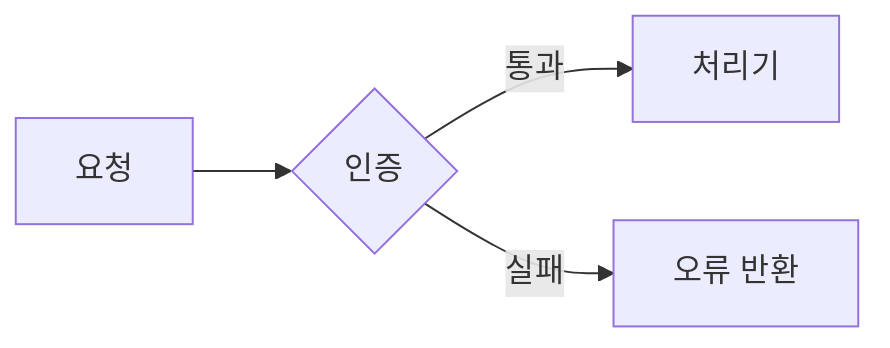
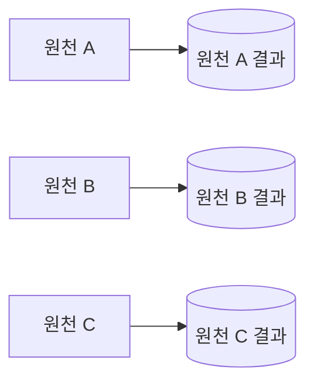

> 이 문서는 `SKILL.md`의 현재 내용을 그대로 반영한 한국어 참고 문서입니다. 에이전트가 > 실행할 때 사용하는 기준 문서는 `SKILL.md`입니다.

# 개발 설계 문서 작성

개발 설계 문서를 새로 쓰거나 기존 문서를 개선할 때 이 규칙을 따른다. 규칙은 문서의 **용어·구성·문단·참조**를 통제하고, 목차는 한 번에 정하지 않고 **좁혀 간다.**

## 언제 쓰는가

- 개발 설계 문서를 새로 작성할 때.
- 기존 설계 문서를 규칙에 맞게 개선하거나, 지나친 상세를 줄여 다듬을 때.
- 설계 문서가 이 규칙을 지키는지 검토할 때.

범위 밖: 단순 번역, 맞춤법·오탈자 교정, 설계 내용과 무관한 문체 윤문.

## 작업 순서

1. **목적과 독자를 정한다.** 새 문서면 다룰 범위와 문서가 답해야 할 판단·구현 질문을 적는다. 개선이면 기존 문서에서 부족하거나 규칙에 어긋난 곳을 적는다.
2. **목차를 좁혀 확정한다.** 아래 "목차를 정하는 절차" 5단계를 순서대로 밟는다. 2단계로 하위 소제목까지 확정한 **뒤에만** 본문을 쓴다.
3. **규칙을 지키며 본문을 쓴다.** 용어·구성·문단과 표·중복과 참조 규칙을 적용한다.
   **용어 교체.** 모든 출현을 찾는다. 자리별(단독 명사, 합성어, 제목, 표 머리글, 코드 식별자)로 가른다.
   후보를 자리마다 넣어 용어 규칙으로 거른다. 제목을 바꾸면 인용을 전부 고치고 인용된 절 제목이 실제 제목과 맞는지 검사한다.
   문서에서 파생된 코드 식별자는 바꾸기 전에 묻는다.
   고치기 전에 교체 표(옛 낱말 → 새 낱말, 자리별)를 하나 만들고 대상 파일 전부에 한 번에 적용한다. 파일마다 따로 바꾸지 않는다.
4. **완료 점검표로 자기 검토한다.** 어긋난 곳을 고치고, 근거를 대지 못하는 문장은 지운다.
   **기계 검사.** 마지막 음절의 종성이 `ㅁ`인 한국어 낱말과 `-됨`·`-야 함`·`-분`을 전부 뽑는다.
   각각을 '라벨과 진술의 결'로 판정해 바꾸거나 남기는 이유를 적고, 건수를 보고한다.
   Mermaid 다이어그램은 모두 실제로 그려서 그림을 눈으로 본다. 문법이 맞아도 화살표가 잘리거나 글자가 겹치거나 한쪽으로만 길게 나올 수 있다.

이 규칙은 설계 문서 작업에만 적용한다. 상위 지시와 충돌하지 않는 한 저장소의 다른 문서 작성 규칙보다 우선한다. 사용자가 특정 규칙을 사용하지 말라고 명시한 경우에만 그 규칙을 제외한다.

## 용어

| 규칙 | 내용 |
|---|---|
| 한 뜻 한 낱말 | 같은 뜻에는 항상 같은 낱말을 쓴다. 원문·초안의 동의어·유의어도 대표 낱말 하나로 통일한다. |
| 쉬운 한국어 | 쉬운 한국어로 쓴다. 영어는 아래 세 경우에만 쓴다. |
| 낱말 하나에 뜻 하나 | 동작·상태·분류를 가리키는 낱말은 접미사를 붙이거나 떼지 않은 그대로 표의 열 이름이나 지표 이름이 되어야 한다.<br>`갈래` → `종류`, `나눔` → `분할`, `채움` → `입력`. 보통 서술어는 이 시험을 받지 않는다. |
| 한 동사에 뜻 하나 | 문맥마다 바꿔 쓸 말이 달라지는 동사는 여러 뜻을 겹쳐 쓰고 있다. 자리마다 그 하나의 뜻을 가리키는 동사로 바꾼다.<br>고유어에서 파생한 말보다 그 분야에 굳은 기술 명사를 먼저 쓴다. `갈리다` → 나뉜다·달라진다·구분된다; `겹침` → `중첩`, `어긋남` → `불일치` |
| 정식 이름은 줄이지 않는다 | 한 번 정한 정식 이름은 뒤에서 줄여 쓰지 않는다. |
| 겹치는 말 교체 | 기존 시스템 용어나 인접 기술 분야의 말과 겹쳐 오해를 부르는 낱말은 다른 말로 바꾼다. |
| 형제와 구별되게 이름 짓기 | 이름은 같은 목록에 놓인 다른 것들과 무엇이 다른지를 담는다. 그 이름이 옆에 있는 것에도 그대로 들어맞으면 그건 개별 이름이 아니라 분류 이름이다. 구성 요소라면 대개 무엇을 만들어 내는지 또는 무엇을 맡는지가 구별점이다. |
| 비유 대신 그대로 | 낱말을 그 정의로 바꿔 넣어도 문장이 그대로 서야 한다. `관문` → `통과 조건`, `구제` → `예외` |
| 사전 뜻만 | 낱말은 사전에 있는 뜻으로만 쓴다. 조어와 다른 분야에서 먼저 굳은 말은 쓰지 않는다. `쌍거리` → `쌍의 거리`, `대사` → `대조`, `토큰` → `키워드` |
| 수식어는 짝이 있을 때만 | 대·신·참 같은 접두어는 없는 형태가 문서 안에서 다른 것을 가리킬 때만 붙인다. `소그룹`이 없으면 `대그룹` → `그룹` |
| 정식 용어의 낱말은 한 뜻만 | 정식 용어에 든 낱말은 문서 안에서 다른 뜻으로 다시 쓰지 않는다. 그 낱말이 뿌리인 관용구도 같다. `코드`(UN/LOCODE) vs `결정론적 코드` → `규칙 프로그램`; `원천` vs `원천적으로` → `애초에` |

영어를 허용하는 세 경우:

- 고유명사 (예: UN/LOCODE, Azure Blob)
- 코드에 실제로 있는 이름 (테이블명·변수명·DAG ID 등)
- 마땅한 한국어가 없는 전문어

겹치는 말 교체 예: git branch와 혼동되는 "브랜치"는 다른 말로 바꾼다. (한 저장소에서 DAG의 병렬 실행 구조를 "분기"로 통일한 사례가 있다.)

작성 순서: 한국어 문서는 먼저 영어로 초안을 쓰고, 그 초안을 한국어로 번역해 완성한다.

## 구성

- 문서마다, 또 한 문서 안 섹션마다 맡은 범위를 겹치지 않게 정한다. 한 주제는 한 곳에서만 다룬다.
- 구현·검증·결정에 필요한 내용만 담는다. 배경 설명이나 있으면 좋은 참고 정보는 뺀다.
- 없애도 이해나 판단이 나빠지지 않는 문장은 지운다.
- 구획 제목은 소제목으로 만든다. 콜론으로 끝나는 문장을 제목으로 쓰지 않는다.
- 제목은 명사구로 쓴다. 서술어를 붙이지 않고 물음으로 끝내지 않는다.

## 크기와 한도

| 대상 | 한도 |
|---|---|
| 한 줄 | 200자 |
| 한 파일 | 500줄 |
| 섹션 깊이 | 3단계 |

한도를 넘지 않으면 파일을 나누지 않는다. 넘치면 역할별로 나눈다.

한 줄 한도는 화면에 보이는 줄을 기준으로 센다. 표 셀 안에서 `<br>` 는 새 줄을 시작하므로, 셀의 각 줄이 한도 안에 있으면 표의 한 행은 한도를 넘어도 된다.

## 문장 결

- 행위 주체: 행위는 행위자만 한다. 주어가 수치·지표·데이터·문서면 서술어는 상태나 변화를 말하고, 의지나 몸짓을 말하지 않는다.
- 셀 수 있으면 센다: 가진 자료로 셀 수 있는 양은 숫자로 쓴다. 셀 수 없을 때만 어림말을 쓴다.
- 지시어: 「이·그」는 같은 절 안만 가리킨다. 절을 벗어나면 가리키는 것을 그대로 쓴다.
- 한 문장에 한 주장을 담는다. 세 가지를 담은 문장은 세 문장이나 표의 한 줄이 된다.
- 주술 일치: 주어와 서술어만 떼어 읽는다. 그 둘이 문장이 되지 않으면 다시 쓴다.
- 낱말 고르기가 여전히 애매하면 그 동작의 정의를 낱말 자리에 넣어 본다. 뜻이 그대로면 맞는 낱말이고, 아니면 정의의 머리말을 쓴다.
- 문장은 완전한 서술어로 끝낸다. 행위자 없는 피동을 쓰지 않는다. `…로 이루어진다` → `…로 한다`, `…만이다` → `…뿐이다`
- 콜론 뒤에 항목을 늘어놓은 문장은 문장이나 표로 바꾼다. `미결 셋: A, B` → `미결은 셋이다. A, B`

## 라벨과 진술의 결

모든 한국어 글자는 두 자리 중 하나에 있고, 자리가 형식을 정한다.

| 자리 | 형식 | 판별 |
|---|---|---|
| 라벨: 표의 열 이름, 다이어그램 노드, 화살표 라벨, ER 주석, 속성이나 값을 가리키는 열 아래의 셀 | 사전에 있는 명사구 | "어느 것인가", "어떤 상태인가"에 답한다 |
| 진술: 본문 문장, 규칙이나 결정을 말하는 목록 항목, 동작·규칙·조건·근거를 가리키는 열 아래의 셀 | 완전한 서술어 | "무엇이 일어나는가", "무엇을 하는가", "어떤 조건인가"에 답한다 |

- 동사·형용사 어간에 명사형 어미(`-ㅁ/-음`, `-기`, `-됨`, `-임`, `-야 함`)를 붙인 말은 어느 형식도 아니며 두 자리 모두에서 쓰지 않는다.
  판별: 그 낱말이 사전에 명사 표제어로 있다. `기록`·`활성`·`분할`은 통과하고 `남김`·`끔`·`나눔`은 걸린다.
- 절을 명사로 압축하는 `-분` 같은 접미사도 같은 이유로 쓰지 않는다. `통과분` → `통과 건`, `이관분` → `이관 값`
- 조건이 붙어야 성립하는 라벨은 진술이다. 서술어로 쓰거나 본문으로 옮긴다.
- 열 이름이 그 아래 모든 셀의 형식을 정하고, 목록은 처음부터 끝까지 한 형식을 지킨다. 한 열이나 한 목록에서 두 형식을 섞지 않는다.
- 상태 라벨(`있음`·`없음`·`아님`)은 무엇을 판정하는지가 열 이름에 있을 때만 그 열의 값으로 쓴다.
- 판단 노드는 무엇을 판정하는지를 적고, 결과는 화살표 라벨이 담는다.

## 문단·표·다이어그램

- 한 문단에는 하나의 핵심만 담는다.
- 항목이 셋 이상이거나 기준이 셋 이상인 비교는 산문이나 불릿이 아니라 표로 쓴다.
  항목 둘을 기준 둘로 비교하는 내용은 한 문장으로 남긴다. 구성 규칙이 지우라고 한 내용은 표로도 돌아오지 않는다.
- 표 셀은 두 문장이나 120자를 넘을 때만 끊는다. 끊을 때는 마지막 문장을 뺀 각 문장 끝에 `<br>` 를 넣는다.
- 셀 안에서 항목이 셋 이상일 때만 항목마다 `<br>· ` 로 시작한다. 셀 안에서는 목록 문법이 그려지지 않는다.
- 그래도 보이는 줄 다섯 줄을 넘을 셀은 본문으로 옮긴다. 셀에는 짧은 말만 남기고 그 절을 가리킨다.
- 구조, 흐름, 상태 변화, 구성 요소 사이의 관계처럼 그림이 글보다 잘 전달하는 부분에는 다이어그램을 적극 쓴다. 다이어그램은 Mermaid로 그린다.
- 단순한 사실 나열이나 한 줄 설명에는 다이어그램을 더하지 않는다. 같은 내용을 글과 그림에 겹쳐 싣지 않는다.
- 다이어그램을 그리기 전에 자문한다: 조건분기나 여러 구성요소 사이의 상호작용·상태 변화가 있는가? 화살표가 순서만 나타내고 분기가 없다면 다이어그램 대신 목록이나 표를 쓴다.
- 다이어그램 내용이 바로 앞뒤 문단에 이미 문장으로 적혀 있다면 다이어그램을 지운다.
- 줄을 나누기 전에 렌더링된 화면이 어떻게 보일지부터 정한다. markdown은 줄바꿈 하나를 공백으로 합쳐 한 문단으로 만든다.
- 화면에 줄바꿈이 보여야 하고 그 형식이 inline HTML을 렌더링한다면 줄 끝에 `<br>`을 붙인다.
- 화면에 줄바꿈이 보여야 하는데 그 형식이 inline HTML을 렌더링하지 않는다면, 문단을 나누거나 목록 항목·표 행으로 바꾼다.
- 화면에 줄바꿈이 보이면 안 되면 문장들을 한 줄에 둔다. 줄은 문장이 끝난 뒤에만 나누고, 문장 중간에서는 나누지 않는다.
- 새 문단은 빈 줄 하나로 구분한다.
- 제목, 표, 코드 블록, 목록의 앞뒤에는 빈 줄을 둔다. 앞 문단에 바로 붙이지 않는다.
- 목록 항목이 여러 줄이면 이어지는 줄을 항목 글자가 시작하는 위치에 맞춰 들여쓴다.
- 문단 안에서 줄을 나누고 싶으면 빈 줄로 문단을 나누거나 목록·표로 구조를 바꿀 수 있는지 먼저 살핀다.
- 줄바꿈을 공백 두 칸으로 표시하지 않는다. 눈에 보이지 않고 저장할 때 지워지기 쉽다. 표 셀 안 줄바꿈도 `<br>`으로 한다.

다이어그램 모양:

- 가로와 세로를 함께 쓴다. 한 방향으로만 늘어선 그림은 방향을 돌려도 똑같이 읽기 어렵다. `LR`을 `TD`로 바꾸는 것은 해결이 아니다.
- 지나가기만 하는 것은 화살표 라벨로 내린다. 큐, 토픽, 파일처럼 주체 사이에서 데이터를 나르기만 하는 것은 화살표에 적는다. 상자는 실제로 무언가를 하는 것에만 준다.
- 폭은 이미 있는 갈래에서 얻는다. 실제 분기와 나란한 결과가 없는 구조를 지어내지 않고도 두 번째 축을 만들어 준다.
- 서브그래프 경계를 넘는 화살표는 상자가 아니라 경계선에 붙어서 어디에 연결되는지 모호해진다. 서브그래프는 나란한 상자 여러 개를 묶고 들어오는 화살표가 적을 때만 쓰고, 상자 하나를 감싸지 않는다.

표로 바꾸는 예:

```markdown
# 나쁜 예 (한 문장에 같은 기준의 사실 아홉 개)
큐 소비자는 재시도를 3회까지 하고 실패한 요청을 보관 큐로 보내며, 배치 적재는 재시도 없이
기록만 남기고, API 핸들러는 재시도를 1회 하고 실패를 호출자에게 돌려준다.

# 좋은 예 (표. 속성 열은 명사구, 동작 열은 서술어)
| 구성요소 | 재시도 | 실패 처리 |
|---|---|---|
| 큐 소비자 | 3회 | 보관 큐로 보낸다 |
| 배치 적재 | 없음 | 기록만 남긴다 |
| API 핸들러 | 1회 | 호출자에게 돌려준다 |
```

다이어그램으로 그리면 좋은 예:

~~~markdown
# 나쁜 예 (단계 사이의 흐름을 산문으로)
요청이 들어오면 인증을 거치고, 통과하면 처리기로 보내고, 실패하면 오류를 돌려준다.

# 좋은 예 (Mermaid 흐름도)

~~~

다이어그램을 걷어내는 예 (분기 없는 나열):

~~~markdown
# 나쁜 예 (분기·상호작용 없는 나열을 다이어그램으로)


# 좋은 예 (문장)
원천 A·B·C는 각자 독립적으로 실행되어 자신의 결과만 만든다.
~~~

## 중복과 참조

- 코드(주석·docstring 포함)에서는 문서를 절대 참조하지 않는다. 문서는 코드 수정 없이 개편·삭제할 수 있어야 한다.
- 같은 내용을 자세히 다루는 문서는 하나만 둔다. 다른 곳에서는 짧게 요약하고 그 문서로 링크한다.
- 요약은 조건을 담은 낱말을 전부 남기고, 쓴 뒤 원문과 나란히 놓고 비교한다. `기록이 대표로 적은 코드` ≠ `기록이 적은 코드`
- 절을 가리키는 참조기호는 쓰지 않는다. 절 번호만 적지 말고 문서 경로와 절 제목을 함께 적는다 — 번호는 개편 때 자주 바뀐다.
- 코드나 외부 원본의 열·타입 같은 상세 계약을 설계 문서에 그대로 옮겨 적을 수 있다. 이때 계약의 기준(SSOT)이 여전히 원본임을 명시하고 계약을 바꿀 때 함께 고칠 파일을 안내한다.

## 목차를 정하는 절차

목차는 한 번에 확정하지 않고 아래 순서로 좁혀 간다.

1. 초안 목차를 만든다. 개선이면 기존 문서의 장 구성에서 출발하고, 새 문서면 다룰 범위를 장으로 나눠 1단계 목차를 만든다.
2. 문서 자체가 이미 하는 역할(예: "한눈에 보기")과 겹치는 섹션, 여러 섹션에 흩어져 이미 드러나는 값의 재나열(예: "이름 규칙" 표)은 뺀다.
3. 도구·표는 그 도구가 실제로 쓰이는 섹션 안으로 옮긴다. 별도 섹션으로 떼어 두지 않는다 (예: 전체 흐름도는 첫 실행 단계를 설명하는 섹션 안에 둔다).
4. 섹션 수를 조정할 때는 항목을 빼는 대신, 성격이 같은 섹션을 합치거나(예: 품질 점검 + 알림 + 배포 준비) 밀도가 높은 섹션을 쪼갠다.
5. 2단계로 각 섹션의 하위 소제목까지 전개해 확정한 뒤에만 본문을 쓴다.

## 완료 점검표

- [ ] 같은 뜻에 같은 낱말을 썼는가. 동의어를 대표 낱말로 통일했는가.
- [ ] 영어는 고유명사·코드 이름·전문어 세 경우에만 남았는가.
- [ ] 시스템 용어와 겹쳐 오해를 부르는 낱말을 바꿨는가.
- [ ] 같은 목록의 옆 항목에도 그대로 들어맞는 이름이 없는가.
- [ ] 비유·조어·차용어·짝 없는 수식어가 남아 있지 않은가.
- [ ] 한국어 문서는 영어 초안을 먼저 쓴 뒤 한국어로 번역했는가.
- [ ] 한 주제가 한 곳에서만 다뤄지는가. 문서·섹션 범위가 겹치지 않는가.
- [ ] 구현·검증·결정에 필요 없는 배경·참고 문장을 뺐는가.
- [ ] 구획 제목이 소제목인가. 콜론으로 끝나는 문장 제목이 없는가.
- [ ] 한 줄 200자·한 파일 500줄·섹션 깊이 3단계를 넘지 않는가. 넘치면 역할별로 나눴는가.
- [ ] 한 문단에 핵심이 하나인가.
- [ ] 항목이나 기준이 셋 이상인 비교를 표로 바꿨고, 둘 × 둘 비교는 산문으로 남겼는가.
- [ ] 구조·흐름·관계를 설명하는 곳에 Mermaid 다이어그램을 활용하고, 단순 나열엔 넣지 않았는가.
- [ ] 각 다이어그램에 조건분기나 구성요소 간 상호작용이 있는가. 순서만 나열한 그림은
      목록·표로 바꿨는가. 인접 문단과 내용이 겹치는 다이어그램은 지웠는가.
- [ ] 한 방향으로만 늘어선 다이어그램이 없는가. 지나가기만 하는 것을 상자가 아니라
      화살표 라벨로 두었는가.
- [ ] 모든 Mermaid 다이어그램을 실제로 그려서 눈으로 확인했는가.
- [ ] 줄바꿈이 문장 끝에서만 일어나는가. 문단은 빈 줄로 나눴는가.
- [ ] 제목·표·코드·목록 앞뒤에 빈 줄이 있고, 여러 줄 목록 항목의 들여쓰기가 맞는가.
- [ ] 문단 안의 모든 줄바꿈이, `<br>`을 렌더링하는 형식에서 `<br>`으로 끝나거나
      한 문단으로 합쳐질 의도인가. 줄바꿈을 공백 두 칸으로 표시한 곳은 없는가.
- [ ] 코드가 문서를 참조하지 않는가.
- [ ] 자세한 내용을 한 문서에 모으고, 다른 곳은 요약·링크했는가.
- [ ] 참조기호 없이 문서 경로와 절 제목으로 참조했는가.
- [ ] 인용한 절 제목이 전부 실제 제목과 일치하는가.
- [ ] 옮겨 적은 상세 계약에 원본이 기준임과 함께 고칠 파일을 밝혔는가.
- [ ] 모든 제목이 서술어와 물음 없는 명사구인가.
- [ ] 동작·상태·분류를 가리키는 낱말이 접미사 변화 없이 표의 열 이름이 되고, 문맥마다 바꿔 쓴 말이 달라지는 동사가 없는가.
- [ ] 라벨은 전부 사전에 있는 명사구이고, 명사형 어미가 붙은 어간이 어느 자리에도 남지 않았고, 각 열과 각 목록이 한 형식인가.
- [ ] 종성 `ㅁ` / `-됨` / `-야 함` / `-분` 검사를 대상 파일 전부에 돌렸고, 걸린 항목마다 교체했거나 남기는 이유를 적었는가.
- [ ] 용어 교체를 교체 표 하나로 전체 파일에 한 번에 적용했는가.
- [ ] 행위자가 아닌 주어가 행위를 하지 않는가. 셀 수 있는 양을 어림말로 두지 않았는가.
- [ ] 절을 벗어나 가리키는 지시어가 가리키는 것을 그대로 밝혔는가.
- [ ] 한 문장에 한 주장만 있고, 주어와 서술어가 맞는가.
- [ ] 모든 문장이 완전한 서술어로 끝나고, 요약이 원문의 조건을 그대로 지키는가.
- [ ] 두 문장이나 120자를 넘는 셀을 `<br>` 로 끊고, 항목이 셋 이상인 셀은 `<br>· ` 로 표시했는가.
- [ ] 보이는 줄 다섯 줄을 넘는 셀이 없고, 보이는 줄이 한 줄 한도를 넘지 않는가.
