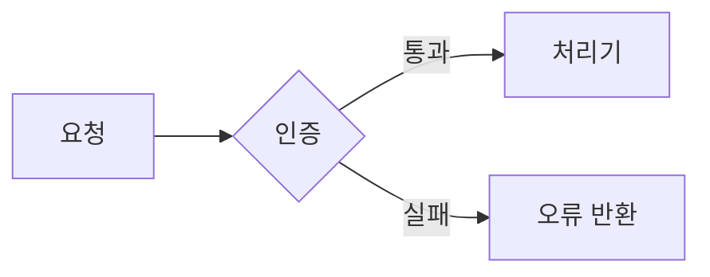
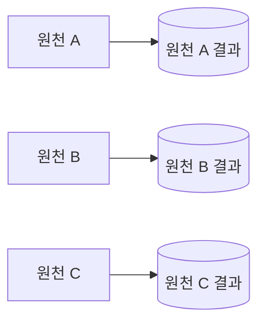

# Technical Design Writing

Apply these rules when creating a technical design document or improving an existing one. The rules govern terminology, structure, paragraphs, and references.
Narrow the outline progressively instead of deciding it all at once.

## Language contract

Use this English `SKILL.md` as the only executable instruction source. `README.ko.md` is a non-authoritative Korean translation for human readers. Do not read or use it while executing the skill.

Korean text in this file is target-language data, including trigger phrases, required wording, and examples. Treat it as content to preserve or produce, not as an additional instruction source.

## When to use this skill

- Create a new technical design document.
- Improve an existing design document or remove excessive detail while applying these rules.
- Review whether a technical design document follows these rules.

Out of scope: translation, spelling or typo correction, and prose polishing unrelated to technical design.

## Workflow

1. **Define the purpose and audience.** For a new document, identify its scope and the decisions or implementation questions it must answer.
   For an existing document, identify missing content and rule violations.
2. **Narrow and finalize the outline.** Follow all five steps in "Outline narrowing process" below. Write the body only after the second-level headings are final.
3. **Write the body under the rules.** Apply the terminology, structure, paragraph, table, duplication, and reference rules.
   **Term replacement.** Find every occurrence. Group them by position (bare noun, compound, heading, table header, code identifier).
   Test candidates in each position against the terminology rules. After renaming a heading, update every citation and verify cited
   section titles against actual headings; ask before renaming code identifiers derived from the document.
   Write one replacement table (old term → new term, by position) before editing and apply it to every file in scope in one pass; never replace file by file.
4. **Review against the completion checklist.** Correct every violation and remove statements that lack supporting evidence.
   **Mechanical scan.** Extract every Korean token whose last syllable has a final `ㅁ`, plus every `-됨`, `-야 함`, and `-분`.
   Judge each against "Label and statement register", replace it or record why it stays, and report the count.
   Render every Mermaid diagram and look at the image: source that parses can still produce clipped arrows, overlapping labels, or a lopsided shape.

Apply these rules only to technical design work. Unless they conflict with higher-priority instructions, they take precedence over other repository writing rules.
Exclude a rule only when the user explicitly asks not to apply it.

## Terminology

| Rule | Requirement |
|---|---|
| One term per meaning | Use the same term for the same meaning. Normalize synonyms in source material or drafts to one canonical term. |
| Plain Korean | Write in plain Korean. Use English only in the three allowed cases below. |
| One reading per word | A word naming an operation, state, or category must serve as a table header or a metric name without adding or removing a suffix.<br>`갈래` → `종류`, `나눔` → `분할`, `채움` → `입력`. Ordinary predicates are exempt. |
| One meaning per verb | When a verb's replacement differs by context, the verb is polysemous; replace each occurrence with the verb naming that one meaning.<br>Prefer the domain's established technical noun over a native verb derivation. `갈리다` → 나뉜다·달라진다·구분된다; `겹침` → `중첩`, `어긋남` → `불일치` |
| No abbreviated canonical terms | Once a term is canonical, never shorten it later in the document. |
| Replace conflicting terms | Replace a term when it overlaps with existing system vocabulary or a neighboring technical field and could cause confusion. |
| Name by what distinguishes | Name a thing by what sets it apart from its siblings. If the name would fit any peer in the same list, it names the category, not the thing. For components, that distinguishing fact is usually what they produce or own. |
| Literal, not figurative | Replacing the word with its definition must leave the sentence intact. `관문` → `통과 조건`, `구제` → `예외` |
| Dictionary sense only | Use a word in its dictionary sense. No coinage, no term whose primary sense belongs to another field. `쌍거리` → `쌍의 거리`, `대사` → `대조`, `토큰` → `키워드` |
| Qualifier needs a contrast | Keep a prefix such as 대·신·참 only when the bare form names something else in the document. `대그룹` → `그룹` when no `소그룹` exists |
| One sense per word | A word inside a canonical term takes no second sense in the document, including idioms built on it. `코드`(UN/LOCODE) vs `결정론적 코드` → `규칙 프로그램`; `원천` vs `원천적으로` → `애초에` |

English is allowed only for:

- Proper nouns, such as UN/LOCODE or Azure Blob.
- Names that exist verbatim in code, such as table names, variable names, or DAG IDs.
- Technical terms without a suitable Korean equivalent.

Conflict example: replace "브랜치" when it could be confused with a Git branch. One repository used "분기" consistently for a DAG's parallel execution structure.

When the final document is Korean, draft it in English first and then translate the completed draft into Korean.
Preserve proper nouns, code identifiers, and technical terms that have no suitable Korean equivalent.

## Structure

- Give every document and every section a distinct, non-overlapping scope. Cover each topic in one place only.
- Include only content needed for implementation, validation, or a decision. Remove background and optional reference material.
- Remove any sentence whose absence would not reduce understanding or decision quality.
- Use subheadings for subdivisions. Do not use a sentence ending in a colon as a heading.
- Make every heading a noun phrase. A heading carries no predicate and asks no question.

## Size limits

| Target | Limit |
|---|---|
| One line | 200 characters |
| One file | 500 lines |
| Section depth | 3 levels |

Do not split a file that stays within the limits. When a limit is exceeded, split by responsibility.

Measure the one-line limit per rendered line. Inside a table cell, `<br>` starts a new rendered line, so a row may exceed the limit while every cell line stays within it.

## Sentence register

- Agency: only an actor acts. When the subject is a number, a metric, a dataset, or a document, the predicate states a state or a change, never an intent or a physical act.
- Countability: when a quantity can be counted from the data at hand, write the count. Use an approximate word only when the count is unavailable.
- Reference: a demonstrative may point only within its own clause. Otherwise name the referent.
- One claim per sentence. A sentence carrying three facts becomes three sentences or a table row.
- Agreement: read the subject and the predicate alone. When the two do not form a sentence, rewrite.
- When a word choice stays unclear, substitute the operation's definition for the word. When the sentence still says the same thing, the word is precise. Otherwise use the word that heads the definition.
- End every sentence with a full predicate; no passive without an actor. `…로 이루어진다` → `…로 한다`, `…만이다` → `…뿐이다`
- A colon followed by items becomes a sentence or a table. `미결 셋: A, B` → `미결은 셋이다. A, B`

## Label and statement register

Every piece of Korean text sits in one of two positions, and the position decides its form.

| Position | Form | Test |
|---|---|---|
| Label: table header, diagram node, edge label, ER comment, cell under a header naming a property or value | Dictionary noun phrase | Answers "which one" or "what state" |
| Statement: body sentence, list item stating a rule or decision, cell under a header naming an action, rule, condition, or reason | Full predicate | Answers "what happens", "what to do", or "under what condition" |

- A verb or adjective stem carrying a nominal suffix (`-ㅁ/-음`, `-기`, `-됨`, `-임`, `-야 함`) is neither form and is banned in both positions.
  Test: the word exists in the dictionary as a noun headword. `기록`·`활성`·`분할` pass; `남김`·`끔`·`나눔` fail.
- A suffix that compresses a clause into a noun, such as `-분`, is banned for the same reason. `통과분` → `통과 건`, `이관분` → `이관 값`
- A label that needs a condition to hold is a statement: write the predicate or move it to the body.
- The header decides the form of every cell below it, and a list keeps one form throughout. Never mix the two forms in one column or one list.
- A binary state label (`있음`·`없음`·`아님`) is allowed only as a cell value under a header naming the property being judged.
- A decision node names the property judged; its edges carry the outcomes.

## Paragraphs, tables, and diagrams

- Keep one central idea in each paragraph.
- Use a table, not prose or bullets, when three or more items, or three or more dimensions, are compared against the same dimensions.
  Two items across two dimensions stay one sentence. Content the Structure rules remove does not return as a table.
- Break a table cell only when it passes two sentences or 120 characters. Then end every sentence but the last with `<br>`.
- Start each item with `<br>· ` when a cell enumerates three or more items, since list markup does not render inside a cell.
- A cell that would still need more than five rendered lines belongs in the section body. Leave a short phrase in the cell and link or name the section.
- Use a Mermaid diagram when it communicates structure, flow, state changes, or component relationships better than prose.
- Do not add a diagram for a simple fact list or a one-line explanation. Do not duplicate the same content in prose and a diagram.
- Before adding a diagram, check whether it shows a conditional branch, interaction among multiple components, or a state change. If arrows only show an unbranched sequence, prefer a list or table.
- Remove a diagram when the adjacent prose already communicates the same information.
- Decide the rendered result before breaking a line. Markdown joins single line breaks into one flowing paragraph.
- When the break must be visible and the target format renders inline HTML, end the line with `<br>`.
- When the break must be visible but the format does not render inline HTML, use a separate paragraph, list item, or table row instead.
- When the break must not be visible, keep the sentences on one line. Break lines only after a sentence ends, never in the middle of a sentence.
- Separate paragraphs with one blank line.
- Put a blank line before and after headings, tables, code blocks, and lists. Do not attach them directly to the preceding paragraph.
- When a list item spans multiple lines, align continuation lines with the first character of the item's text.
- Before forcing a line break inside a paragraph, check whether a new paragraph, list, or table would express the structure better.
- Never mark a break with two trailing spaces, which are invisible and easily removed. Use `<br>` inside table cells as well.

Diagram shape:

- Balance the two dimensions. A diagram that runs in one direction only stays just as hard to read after rotating it; switching `LR` to `TD` is not a fix.
- Demote pass-through elements to edge labels. Queues, topics, files, and anything that only carries data between actors belongs on the arrow. Reserve boxes for things that act.
- Get width from the branches that already exist. Real forks and sibling outcomes create the second dimension without inventing structure.
- An arrow crossing a subgraph boundary attaches to the boundary, not to the node, so its endpoint becomes ambiguous. Use a subgraph only for sibling nodes with few arrows crossing in, and never wrap a single node.

Example of when to use a table:

```markdown
# Bad example: one sentence carries nine facts across the same dimensions
큐 소비자는 재시도를 3회까지 하고 실패한 요청을 보관 큐로 보내며, 배치 적재는 재시도 없이
기록만 남기고, API 핸들러는 재시도를 1회 하고 실패를 호출자에게 돌려준다.

# Good example: table. The property column takes noun phrases, the action column takes predicates
| 구성요소 | 재시도 | 실패 처리 |
|---|---|---|
| 큐 소비자 | 3회 | 보관 큐로 보낸다 |
| 배치 적재 | 없음 | 기록만 남긴다 |
| API 핸들러 | 1회 | 호출자에게 돌려준다 |
```

Example of when to use a diagram:

~~~markdown
# Bad example: prose describes a flow between steps
요청이 들어오면 인증을 거치고, 통과하면 처리기로 보내고, 실패하면 오류를 돌려준다.

# Good example: Mermaid flowchart

~~~

Example of when to remove a diagram:

~~~markdown
# Bad example: a diagram shows only independent, unbranched items


# Good example: prose
원천 A·B·C는 각자 독립적으로 실행되어 자신의 결과만 만든다.
~~~

## Duplication and references

- Never reference documentation from code, including comments and docstrings. Documentation must be free to change or disappear without requiring code changes.
- Keep one detailed source for each topic. Summarize it briefly elsewhere and link to that source.
- A summary keeps every word that carries a condition; compare it with the source sentence after writing. `기록이 대표로 적은 코드` ≠ `기록이 적은 코드`
- Do not use reference symbols for sections. Do not cite a section number alone; include the document path and section title because numbering changes during restructuring.
- A design document may copy a detailed contract such as columns or types from code or an external source.
  State that the original remains the source of truth and identify every file that must change with the contract.

## Outline narrowing process

Do not finalize the outline in one pass. Narrow it in this order:

1. Draft the outline. For an existing document, start from its current chapter structure. For a new document, divide the scope into a first-level outline.
2. Remove sections that duplicate a role the document already performs, such as "한눈에 보기". Also remove restatements of values already visible across multiple sections, such as a separate "이름 규칙" table.
3. Place each tool or table inside the section where it is actually used. Do not isolate it as a separate section.
   For example, put an overall flowchart in the section that explains the first execution step.
4. Adjust the section count by merging related sections or splitting dense sections, not by dropping required topics.
   For example, quality checks, notifications, and deployment preparation may form one section.
5. Expand every section through second-level headings and finalize them before writing the body.

## Completion checklist

- [ ] The same meaning always uses the same canonical term.
- [ ] English remains only for proper nouns, code names, and technical terms without a suitable
      Korean equivalent.
- [ ] Terms that conflict with system vocabulary have been replaced.
- [ ] No name would fit a sibling in the same list.
- [ ] No figurative, coined, borrowed, or contrast-less qualified term remains.
- [ ] A Korean document was drafted in English before it was translated into Korean.
- [ ] Each topic appears in one place, and document or section scopes do not overlap.
- [ ] Background and reference sentences unnecessary for implementation, validation, or decisions
      have been removed.
- [ ] Every subdivision uses a subheading, and no heading is a sentence ending in a colon.
- [ ] No line exceeds 200 characters, no file exceeds 500 lines, and section depth does not exceed
      three levels. Files exceeding a limit are split by responsibility.
- [ ] Every paragraph has one central idea.
- [ ] Comparisons of three or more items or dimensions use tables, and two-by-two comparisons stay in prose.
- [ ] Mermaid diagrams explain structures, flows, or relationships where useful and are absent from
      simple lists.
- [ ] Every diagram adds a branch, component interaction, or state change that prose or a table would
      not communicate more clearly. Redundant diagrams have been removed.
- [ ] No diagram runs in a single direction, and pass-through elements are edge labels, not boxes.
- [ ] Every Mermaid diagram was rendered and visually inspected.
- [ ] Lines break only after complete sentences, and blank lines separate paragraphs.
- [ ] Headings, tables, code blocks, and lists have surrounding blank lines, and multiline list items
      align correctly.
- [ ] Every source line break inside a paragraph either ends with `<br>` in a format that renders it,
      or is intended to flow together. Trailing spaces are never used to mark a break.
- [ ] Code does not reference documentation.
- [ ] Detailed content has one canonical location, with summaries and links elsewhere.
- [ ] References use document paths and section titles without reference symbols.
- [ ] Every cited section title matches an actual heading.
- [ ] Copied contracts identify the original source of truth and every file that must change with it.
- [ ] Every heading is a noun phrase without a predicate or a question.
- [ ] Every word naming an operation, state, or category serves as a table header without a suffix change, and no verb takes a different replacement in different sentences.
- [ ] Every label is a dictionary noun phrase, no stem with a nominal suffix survives in any position, and each column and list keeps one form.
- [ ] The ㅁ-final / -됨 / -야 함 / -분 scan covered every file in scope, and each hit was replaced or justified.
- [ ] Term replacement used one replacement table applied across all files in one pass.
- [ ] No non-actor subject performs an act, and no countable quantity is left approximate.
- [ ] Every demonstrative that reaches outside its clause names its referent.
- [ ] Each sentence carries one claim, and its subject governs its predicate.
- [ ] Every sentence ends in a full predicate, and every summary preserves its source's conditions.
- [ ] Cells past two sentences or 120 characters break with `<br>`, and cells enumerating three or more items mark each with `<br>· `.
- [ ] No cell needs more than five rendered lines, and no rendered line exceeds the one-line limit.
