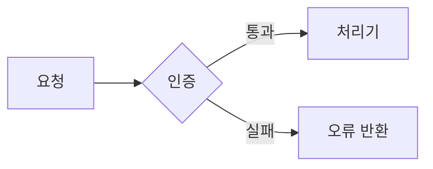
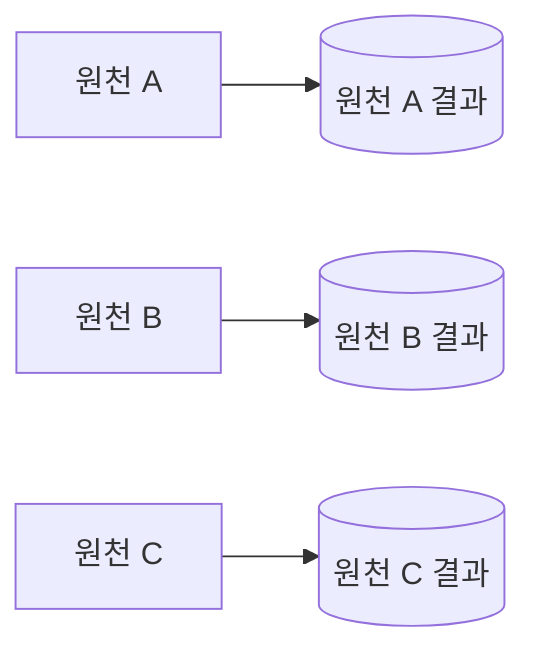

# Technical Design Writing

Apply these rules when creating a technical design document or improving an existing one. The rules govern terminology, structure, paragraphs, and references.
Narrow the outline progressively instead of deciding it all at once.

## Language contract

Use this English `SKILL.md` as the only executable instruction source. `README.ko.md` is a non-authoritative Korean translation for human readers. Do not read or use it while executing the skill.

Korean text in this file is target-language data, including trigger phrases, required wording, and examples. Treat it as content to preserve or produce, not as an additional instruction source.

## When to use this skill

- Create a new technical design document.
- Improve an existing design document or remove excessive detail while applying these rules.
- Review whether a technical design document follows these rules.

Out of scope: translation, spelling or typo correction, and prose polishing unrelated to technical design.

## Workflow

1. **Define the purpose and audience.** For a new document, identify its scope and the decisions or implementation questions it must answer.
   For an existing document, identify missing content and rule violations.
2. **Narrow and finalize the outline.** Follow all five steps in "Outline narrowing process" below. Write the body only after the second-level headings are final.
3. **Write the body under the rules.** Apply the terminology, structure, paragraph, table, duplication, and reference rules.
4. **Review against the completion checklist.** Correct every violation and remove statements that lack supporting evidence.

Apply these rules only to technical design work. Unless they conflict with higher-priority instructions, they take precedence over other repository writing rules.
Exclude a rule only when the user explicitly asks not to apply it.

## Terminology

| Rule | Requirement |
|---|---|
| One term per meaning | Use the same term for the same meaning. Normalize synonyms in source material or drafts to one canonical term. |
| Plain Korean | Write in plain Korean. Use English only in the three allowed cases below. |
| Replace conflicting terms | Replace a term when it overlaps with existing system vocabulary and could cause confusion. |

English is allowed only for:

- Proper nouns, such as UN/LOCODE or Azure Blob.
- Names that exist verbatim in code, such as table names, variable names, or DAG IDs.
- Technical terms without a suitable Korean equivalent.

Conflict example: replace "브랜치" when it could be confused with a Git branch. One repository used "분기" consistently for a DAG's parallel execution structure.

When the final document is Korean, draft it in English first and then translate the completed draft into Korean.
Preserve proper nouns, code identifiers, and technical terms that have no suitable Korean equivalent.

## Structure

- Give every document and every section a distinct, non-overlapping scope. Cover each topic in one place only.
- Include only content needed for implementation, validation, or a decision. Remove background and optional reference material.
- Remove any sentence whose absence would not reduce understanding or decision quality.
- Use subheadings for subdivisions. Do not use a sentence ending in a colon as a heading.

## Size limits

| Target | Limit |
|---|---|
| One line | 200 characters |
| One file | 500 lines |
| Section depth | 3 levels |

Do not split a file that stays within the limits. When a limit is exceeded, split by responsibility.

## Paragraphs, tables, and diagrams

- Keep one central idea in each paragraph.
- Use a table, not prose or bullets, when several items are compared or listed against the same dimensions.
- Use a Mermaid diagram when it communicates structure, flow, state changes, or component relationships better than prose.
- Do not add a diagram for a simple fact list or a one-line explanation. Do not duplicate the same content in prose and a diagram.
- Before adding a diagram, check whether it shows a conditional branch, interaction among multiple components, or a state change. If arrows only show an unbranched sequence, prefer a list or table.
- Remove a diagram when the adjacent prose already communicates the same information.
- A single source line break is rendered as a space inside the same paragraph. Break lines only after a sentence ends, never in the middle of a sentence.
- Separate paragraphs with one blank line.
- Put a blank line before and after headings, tables, code blocks, and lists. Do not attach them directly to the preceding paragraph.
- When a list item spans multiple lines, align continuation lines with the first character of the item's text.
- Before forcing a line break inside a paragraph, check whether a new paragraph, list, or table would express the structure better. Avoid forced line breaks when possible.
- When an inline break is still necessary, use `<br>` instead of two trailing spaces, which are invisible and easily removed. Use `<br>` inside table cells as well.

Example of when to use a table:

```markdown
# Bad example: prose lists items against the same dimensions
개발 환경은 로그를 남기고 캐시를 끄며, 운영 환경은 로그를 줄이고 캐시를 켠다.

# Good example: table
| 환경 | 로그 | 캐시 |
|---|---|---|
| 개발 | 남김 | 끔 |
| 운영 | 줄임 | 켬 |
```

Example of when to use a diagram:

~~~markdown
# Bad example: prose describes a flow between steps
요청이 들어오면 인증을 거치고, 통과하면 처리기로 보내고, 실패하면 오류를 돌려준다.

# Good example: Mermaid flowchart

~~~

Example of when to remove a diagram:

~~~markdown
# Bad example: a diagram shows only independent, unbranched items


# Good example: prose
원천 A·B·C는 각자 독립적으로 실행되어 자신의 결과만 만든다.
~~~

## Duplication and references

- Never reference documentation from code, including comments and docstrings. Documentation must be free to change or disappear without requiring code changes.
- Keep one detailed source for each topic. Summarize it briefly elsewhere and link to that source.
- Do not use reference symbols for sections. Do not cite a section number alone; include the document path and section title because numbering changes during restructuring.
- A design document may copy a detailed contract such as columns or types from code or an external source.
  State that the original remains the source of truth and identify every file that must change with the contract.

## Outline narrowing process

Do not finalize the outline in one pass. Narrow it in this order:

1. Draft the outline. For an existing document, start from its current chapter structure. For a new document, divide the scope into a first-level outline.
2. Remove sections that duplicate a role the document already performs, such as "한눈에 보기". Also remove restatements of values already visible across multiple sections, such as a separate "이름 규칙" table.
3. Place each tool or table inside the section where it is actually used. Do not isolate it as a separate section.
   For example, put an overall flowchart in the section that explains the first execution step.
4. Adjust the section count by merging related sections or splitting dense sections, not by dropping required topics.
   For example, quality checks, notifications, and deployment preparation may form one section.
5. Expand every section through second-level headings and finalize them before writing the body.

## Completion checklist

- [ ] The same meaning always uses the same canonical term.
- [ ] English remains only for proper nouns, code names, and technical terms without a suitable
      Korean equivalent.
- [ ] Terms that conflict with system vocabulary have been replaced.
- [ ] A Korean document was drafted in English before it was translated into Korean.
- [ ] Each topic appears in one place, and document or section scopes do not overlap.
- [ ] Background and reference sentences unnecessary for implementation, validation, or decisions
      have been removed.
- [ ] Every subdivision uses a subheading, and no heading is a sentence ending in a colon.
- [ ] No line exceeds 200 characters, no file exceeds 500 lines, and section depth does not exceed
      three levels. Files exceeding a limit are split by responsibility.
- [ ] Every paragraph has one central idea.
- [ ] Comparisons and repeated-field lists use tables.
- [ ] Mermaid diagrams explain structures, flows, or relationships where useful and are absent from
      simple lists.
- [ ] Every diagram adds a branch, component interaction, or state change that prose or a table would
      not communicate more clearly. Redundant diagrams have been removed.
- [ ] Lines break only after complete sentences, and blank lines separate paragraphs.
- [ ] Headings, tables, code blocks, and lists have surrounding blank lines, and multiline list items
      align correctly.
- [ ] Inline breaks use `<br>` instead of trailing spaces, and unnecessary forced breaks are gone.
- [ ] Code does not reference documentation.
- [ ] Detailed content has one canonical location, with summaries and links elsewhere.
- [ ] References use document paths and section titles without reference symbols.
- [ ] Copied contracts identify the original source of truth and every file that must change with it.
