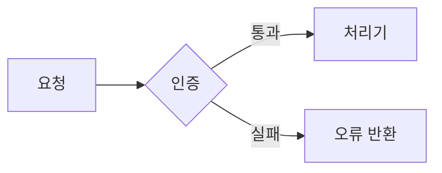

# 개발 설계 문서 작성

개발 설계 문서를 새로 쓰거나 기존 문서를 개선할 때 이 규칙을 따른다.
규칙은 문서의 **용어·구성·문단·참조**를 통제하고, 목차는 한 번에 정하지 않고 **좁혀 간다.**

## 언제 쓰는가

- 개발 설계 문서를 새로 작성할 때.
- 기존 설계 문서를 규칙에 맞게 개선하거나, 지나친 상세를 줄여 다듬을 때.
- 설계 문서가 이 규칙을 지키는지 검토할 때.

범위 밖: 단순 번역, 맞춤법·오탈자 교정, 설계 내용과 무관한 문체 윤문.

## 작업 순서

1. **목적과 독자를 정한다.** 새 문서면 다룰 범위와 문서가 답해야 할 판단·구현
   질문을 적는다. 개선이면 기존 문서에서 부족하거나 규칙에 어긋난 곳을 적는다.
2. **목차를 좁혀 확정한다.** 아래 "목차를 정하는 절차" 5단계를 순서대로 밟는다.
   2단계로 하위 소제목까지 확정한 **뒤에만** 본문을 쓴다.
3. **규칙을 지키며 본문을 쓴다.** 용어·구성·문단과 표·중복과 참조 규칙을 적용한다.
4. **완료 점검표로 자기 검토한다.** 어긋난 곳을 고치고, 근거를 대지 못하는
   문장은 지운다.

이 규칙은 설계 문서 작업에만 적용한다. 상위 지시와 충돌하지 않는 한 저장소의 다른 문서
작성 규칙보다 우선한다. 사용자가 특정 규칙을 사용하지 말라고 명시한 경우에만 그 규칙을 제외한다.

## 용어

| 규칙 | 내용 |
|---|---|
| 한 뜻 한 낱말 | 같은 뜻에는 항상 같은 낱말을 쓴다. 원문·초안의 동의어·유의어도 대표 낱말 하나로 통일한다. |
| 쉬운 한국어 | 쉬운 한국어로 쓴다. 영어는 아래 세 경우에만 쓴다. |
| 겹치는 말 교체 | 기존 시스템 용어와 겹쳐 오해를 부르는 낱말은 다른 말로 바꾼다. |

영어를 허용하는 세 경우:

- 고유명사 (예: UN/LOCODE, Azure Blob)
- 코드에 실제로 있는 이름 (테이블명·변수명·DAG ID 등)
- 마땅한 한국어가 없는 전문어

겹치는 말 교체 예: git branch와 혼동되는 "브랜치"는 다른 말로 바꾼다.
(한 저장소에서 DAG의 병렬 실행 구조를 "분기"로 통일한 사례가 있다.)

## 구성

- 문서마다, 또 한 문서 안 섹션마다 맡은 범위를 겹치지 않게 정한다. 한 주제는 한 곳에서만 다룬다.
- 구현·검증·결정에 필요한 내용만 담는다. 배경 설명이나 있으면 좋은 참고 정보는 뺀다.
- 없애도 이해나 판단이 나빠지지 않는 문장은 지운다.
- 구획 제목은 소제목으로 만든다. 콜론으로 끝나는 문장을 제목으로 쓰지 않는다.

## 크기와 한도

| 대상 | 한도 |
|---|---|
| 한 줄 | 200자 |
| 한 파일 | 500줄 |
| 섹션 깊이 | 3단계 |

한도를 넘지 않으면 파일을 나누지 않는다. 넘치면 역할별로 나눈다.

## 문단·표·다이어그램

- 한 문단에는 하나의 핵심만 담는다.
- 여러 항목을 같은 기준으로 비교하거나 나열하는 규칙은 산문이나 불릿이 아니라 표로 쓴다.
- 구조, 흐름, 상태 변화, 구성 요소 사이의 관계처럼 그림이 글보다 잘 전달하는 부분에는
  다이어그램을 적극 쓴다. 다이어그램은 Mermaid로 그린다.
- 단순한 사실 나열이나 한 줄 설명에는 다이어그램을 더하지 않는다.
  같은 내용을 글과 그림에 겹쳐 싣지 않는다.
- 원문에서 문장 끝의 줄바꿈 하나는 미리보기에서 공백으로 합쳐져 한 문단이 된다.
  그래서 줄은 문장이 끝난 뒤에만 나누고, 문장 중간에서는 나누지 않는다.
- 새 문단은 빈 줄 하나로 구분한다.
- 제목, 표, 코드 블록, 목록의 앞뒤에는 빈 줄을 둔다. 앞 문단에 바로 붙이지 않는다.
- 목록 항목이 여러 줄이면 이어지는 줄을 항목 글자가 시작하는 위치에 맞춰 들여쓴다.
- 문단 안에서 줄을 나누고 싶으면 빈 줄로 문단을 나누거나 목록·표로 구조를 바꿀 수
  있는지 먼저 살핀다. 강제 줄바꿈은 되도록 쓰지 않는다.
- 그래도 문단 안 줄바꿈이 필요하면 눈에 보이지 않고 저장할 때 지워지기 쉬운 공백 두 칸
  대신 `<br>`을 쓴다. 표 셀 안 줄바꿈도 `<br>`으로 한다.

표로 바꾸는 예:

```markdown
# 나쁜 예 (같은 기준의 나열을 산문으로)
개발 환경은 로그를 남기고 캐시를 끄며, 운영 환경은 로그를 줄이고 캐시를 켠다.

# 좋은 예 (표)
| 환경 | 로그 | 캐시 |
|---|---|---|
| 개발 | 남김 | 끔 |
| 운영 | 줄임 | 켬 |
```

다이어그램으로 그리면 좋은 예:

~~~markdown
# 나쁜 예 (단계 사이의 흐름을 산문으로)
요청이 들어오면 인증을 거치고, 통과하면 처리기로 보내고, 실패하면 오류를 돌려준다.

# 좋은 예 (Mermaid 흐름도)

~~~

## 중복과 참조

- 코드(주석·docstring 포함)에서는 문서를 절대 참조하지 않는다.
  문서는 코드 수정 없이 개편·삭제할 수 있어야 한다.
- 같은 내용을 자세히 다루는 문서는 하나만 둔다. 다른 곳에서는 짧게 요약하고 그 문서로 링크한다.
- 절을 가리키는 참조기호는 쓰지 않는다. 절 번호만 적지 말고 문서 경로와 절 제목을
  함께 적는다 — 번호는 개편 때 자주 바뀐다.
- 코드나 외부 원본의 열·타입 같은 상세 계약을 설계 문서에 그대로 옮겨 적을 때는, 그
  계약의 기준(SSOT)이 여전히 원본임을 명시하고 계약을 바꿀 때 함께 고칠 파일을 안내한다.

## 목차를 정하는 절차

목차는 한 번에 확정하지 않고 아래 순서로 좁혀 간다.

1. 초안 목차를 만든다. 개선이면 기존 문서의 장 구성에서 출발하고, 새 문서면 다룰
   범위를 장으로 나눠 1단계 목차를 만든다.
2. 문서 자체가 이미 하는 역할(예: "한눈에 보기")과 겹치는 섹션, 여러 섹션에 흩어져
   이미 드러나는 값의 재나열(예: "이름 규칙" 표)은 뺀다.
3. 도구·표는 그 도구가 실제로 쓰이는 섹션 안으로 옮긴다. 별도 섹션으로 떼어 두지
   않는다 (예: 전체 흐름도는 첫 실행 단계를 설명하는 섹션 안에 둔다).
4. 섹션 수를 조정할 때는 항목을 빼는 대신, 성격이 같은 섹션을 합치거나(예: 품질 점검 +
   알림 + 배포 준비) 밀도가 높은 섹션을 쪼갠다.
5. 2단계로 각 섹션의 하위 소제목까지 전개해 확정한 뒤에만 본문을 쓴다.

## 완료 점검표

- [ ] 같은 뜻에 같은 낱말을 썼는가. 동의어를 대표 낱말로 통일했는가.
- [ ] 영어는 고유명사·코드 이름·전문어 세 경우에만 남았는가.
- [ ] 시스템 용어와 겹쳐 오해를 부르는 낱말을 바꿨는가.
- [ ] 한 주제가 한 곳에서만 다뤄지는가. 문서·섹션 범위가 겹치지 않는가.
- [ ] 구현·검증·결정에 필요 없는 배경·참고 문장을 뺐는가.
- [ ] 구획 제목이 소제목인가. 콜론으로 끝나는 문장 제목이 없는가.
- [ ] 한 줄 200자·한 파일 500줄·섹션 깊이 3단계를 넘지 않는가. 넘치면 역할별로 나눴는가.
- [ ] 한 문단에 핵심이 하나인가.
- [ ] 같은 기준의 비교·나열을 표로 바꿨는가.
- [ ] 구조·흐름·관계를 설명하는 곳에 Mermaid 다이어그램을 활용하고, 단순 나열엔 넣지 않았는가.
- [ ] 줄바꿈이 문장 끝에서만 일어나는가. 문단은 빈 줄로 나눴는가.
- [ ] 제목·표·코드·목록 앞뒤에 빈 줄이 있고, 여러 줄 목록 항목의 들여쓰기가 맞는가.
- [ ] 문단 안 줄바꿈에 공백 두 칸 대신 `<br>`을 썼는가. 불필요한 강제 줄바꿈은 없앴는가.
- [ ] 코드가 문서를 참조하지 않는가.
- [ ] 자세한 내용을 한 문서에 모으고, 다른 곳은 요약·링크했는가.
- [ ] 참조기호 없이 문서 경로와 절 제목으로 참조했는가.
- [ ] 옮겨 적은 상세 계약에 원본이 기준임과 함께 고칠 파일을 밝혔는가.
